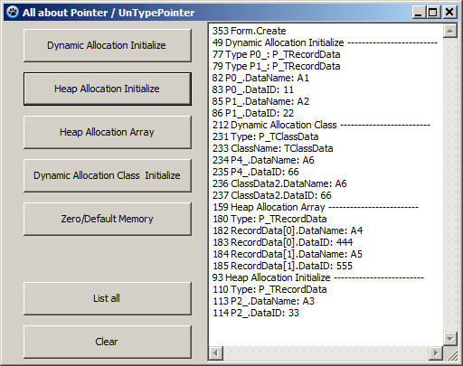

# All_About_Pointer_in_Pascal
All about pointer in Pascal

Keyword:
  - TClassDataPointer to UnTypePointer
  - UnTypePointer to TClassDataPointer
  - TRecordDataPointer to UnTypePointer
  - UnTypePointer to TRecordDataPointer
  - Display result within the pointer
  - Initialize UnTypePointer
  - Initialize TClassDataPointer
  - Initialize TRecordDataPointer
  - Initialize array
  - Compair type of pointer
  - Display type of pointer
  - Free memory UnTypePointer
  - Free memory TClassDataPointer
  - Free memory TRecordDataPointer
